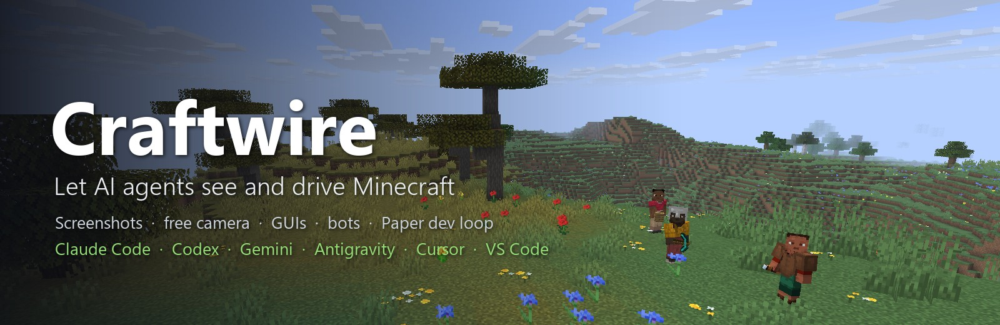
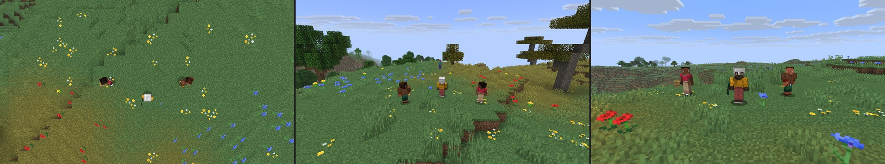
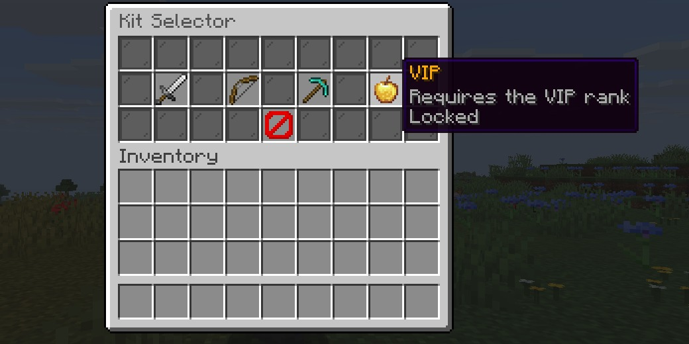
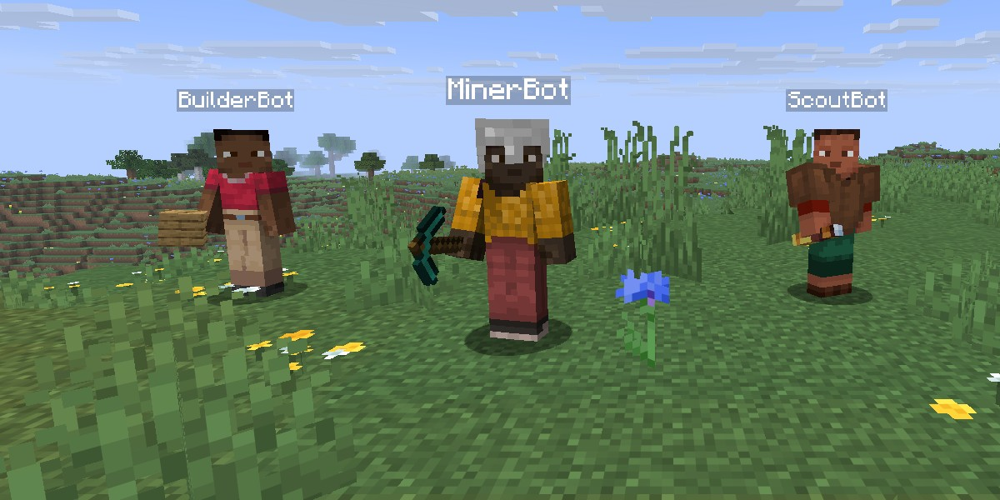

<p align="center">
  
</p>

<p align="center">
  <a href="https://github.com/uxplima/craftwire/releases"></a>
  <a href="https://www.npmjs.com/package/craftwire"></a>
  <a href="https://github.com/uxplima/craftwire/actions/workflows/ci.yml"></a>
  
  
</p>

**Craftwire** is an MCP server that gives AI agents eyes and hands in Minecraft. The agent takes screenshots from any angle, reads and clicks menus, chats, presses keys and reads the HUD on a **Fabric client**. On a **Paper server** it runs console commands and JavaScript against the Bukkit API, reads and edits the world, spawns bots that play like real players, and builds, deploys and restarts your plugin in one step.

It works with Claude Code, Codex, Gemini CLI, Antigravity, Cursor, Windsurf, VS Code, Claude Desktop and any other MCP client that runs local servers.

Every picture on this page was taken by Craftwire itself, through the tools below, on a throwaway test server.

## What it can do

### See the game from any angle

`screenshot` captures what the player sees, or renders from any camera pose without moving the player. Terrain behind the player is rendered too, with or without Sodium. Use it to check a build from above, frame a scene for a promo shot, or watch a test from the side.



### Read and click menus like a player

`gui_read` returns the open screen as data: every slot with its item, name and lore, plus buttons and text fields. `gui_action` hovers, clicks, drags and types. Plugin menus built from chests work like any other screen.



```jsonc
// gui_read, trimmed
{
  "open": true, "title": "Kit Selector", "type": "ContainerScreen",
  "hovered": { "slot": 16, "item": { "id": "minecraft:golden_apple", "name": "VIP", "lore": ["Requires the VIP rank", "Locked"] } },
  "slots": [
    { "slot": 14, "id": "minecraft:diamond_pickaxe", "name": "Miner", "lore": ["Efficiency V pickaxe", "Click to select", "..."] },
    { "slot": 22, "id": "minecraft:barrier", "name": "Close", "lore": [] }
  ]
}
```

### Bots that plugins treat as players

`bot_spawn` puts fake players on the Paper server. They join with a join event and a tab-list entry. `bot_action` makes them chat, run commands (and returns what the server answered), walk, look, use items, attack, open and click plugin menus, and read their own HUD (scoreboard sidebar, tab list, boss bars, titles). Plugins see the same events a real client would cause, so you can test a shop, a minigame or a permission check without a second account.



### Drive the server and your plugin dev loop

- `server_command` runs console commands and returns their output. `server_eval` runs JavaScript with the full Bukkit API.
- `world_query` and `world_edit` read and change blocks, and take snapshots you can restore.
- `server_process` starts, stops and restarts a local Paper server. It never accepts the EULA for you.
- `events` records every Bukkit event, your plugin's own events included: what fired, with which values, whether it ended up cancelled, and which plugins listen to it.
- `exceptions` groups the stack traces of the server and the clients into distinct bugs, with a count and the plugin and line to blame.
- `plugin_deploy` builds your plugin (Gradle or Maven), swaps the jar, restarts the server and reports whether the plugin enabled and what it logged. Compiler errors come back as `file:line`.

> *"Build my plugin, deploy it to ~/servers/test, spawn two bots, have one open /shop and buy the first item, and tell me what the plugin answered."*

### Test your plugin with scenarios

A scenario is a plugin test written as JSON: bots run commands and click menus, and checks wait for the message, the block, the item or the event that should follow. When a check fails you get the expected and actual values plus what the bots saw, which events fired and which exceptions were logged at that moment. Run them from the AI with `scenario_run`, or in CI with `npx craftwire test --server <dir> --junit report.xml`. See [docs/scenarios.md](docs/scenarios.md).

```json
{ "name": "shop sells a diamond", "bots": ["Buyer"],
  "steps": [
    { "bot": "Buyer", "command": "/shop" },
    { "bot": "Buyer", "action": "gui_click", "slot": 13 },
    { "expect_message": { "bot": "Buyer", "matches": "you bought a diamond" } },
    { "expect_no_exceptions": {} } ] }
```

### Give the AI your plugin's own tools

A plugin or mod can add its own tools through a small API (`craftwire-api`, no dependencies), for example `myshop_coins` to read a player's balance, or a tool that sets up a test auction in one call. They appear next to the built-in tools, run on the game thread, and are removed when the plugin is disabled. See [docs/extensions.md](docs/extensions.md).

### Let the AI run its own client

You don't have to keep the game open. `client_process` starts a Minecraft client the hub runs itself:
- The window is hidden, the client runs in offline mode, and it joins the server that `server_process` started.
- Every client tool then works on it: screenshots, menus, input, the HUD.
- The first start downloads Minecraft and Fabric straight from Mojang and Fabric (about 250 MB, cached in `~/.craftwire/client`). Later starts take about 10 seconds.
- `mods` loads extra jars next to the agent, such as the Fabric mod you are building or Sodium.

The launcher is part of Craftwire: no third-party launcher, every file checked against its published sha1, and your own `.minecraft` is never touched. Offline mode needs a dev server with `online-mode=false`. You still need to own Minecraft Java Edition; this is the same model as Fabric's development client.

> *"Start a client, open /kits on the test server and show me what the VIP kit's tooltip looks like."*

## Install

You need three parts:
- **The hub**, which your AI client starts. It is the `craftwire` npm package and needs Node.js 20 or newer.
- **The agent mod** for the Minecraft client (`craftwire-agent-fabric-<version>.jar`). It is a Fabric mod and needs Fabric API.
- **The plugin** for a Paper server (`craftwire-paper-<version>.jar`), if you want the server tools.

Both jars are on [Releases](https://github.com/uxplima/craftwire/releases). One jar of each runs on Minecraft 26.2 and 26.3: it picks the right code for the game it is loaded into.

### 1. Connect your AI client

<details open>
<summary><b>Claude Code</b>: plugin (hub, skills and updates in one)</summary>

```
/plugin marketplace add uxplima/craftwire
/plugin install craftwire@uxplima
```
</details>

<details>
<summary><b>Codex</b></summary>

```
npx craftwire setup codex
```
This adds `[mcp_servers.craftwire]` to `~/.codex/config.toml` and copies the Craftwire skills to `~/.codex/skills/`.
</details>

<details>
<summary><b>Gemini CLI</b></summary>

```
npx craftwire setup gemini
```
This adds `craftwire` to `~/.gemini/settings.json` and copies the skills to `~/.gemini/skills/`.
</details>

<details>
<summary><b>Antigravity</b></summary>

```
npx craftwire setup antigravity
```
This adds `craftwire` to `~/.gemini/config/mcp_config.json`.
</details>

<details>
<summary><b>Cursor</b> · <b>Windsurf</b> · <b>VS Code</b> · <b>Claude Desktop</b></summary>

```
npx craftwire setup cursor          # ~/.cursor/mcp.json
npx craftwire setup windsurf        # ~/.codeium/windsurf/mcp_config.json
npx craftwire setup vscode          # user mcp.json (Copilot agent mode)
npx craftwire setup claude-desktop  # claude_desktop_config.json
```
</details>

<details>
<summary><b>Any other MCP client</b></summary>

Run it over stdio: command `npx`, arguments `-y craftwire`. On Windows use `cmd /c npx -y craftwire`.
</details>

`npx craftwire setup` with no client lists the ones it finds on your computer. Add `--dry-run` to see the change without writing it. Setup only touches the `craftwire` entry, and it backs the old file up as `.bak` first. Manual configs for every client are in [docs/clients.md](docs/clients.md). Restart the client afterwards.

### 2. Add the game side

- **Client:** put the agent mod and Fabric API in your Fabric profile's `mods/` folder and start the game. When the hub is running, a green **⚡ Craftwire connected** appears in the top-left corner. **F8** pauses AI control at any time.
- **Server:** put the plugin in the Paper server's `plugins/` folder and start it. The plugin connects to the hub on its own. The first start downloads GraalJS (for `server_eval`), so it needs network access once.

Then ask your AI: *"take a screenshot of what I'm looking at"* or *"what's the TPS, and which plugins logged errors since startup?"*.

## Tools

| Area | Tools |
|---|---|
| Hub | `list_instances` · `wait_for` · `get_request_status` · `logs` · `exceptions` |
| Client | `screenshot` · `camera` · `gui_read` · `gui_action` · `input` · `chat` · `hud_read` · `player_state` · `client_settings` |
| Server | `server_command` · `server_eval` · `world_query` · `world_edit` · `server_info` · `plugin_manage` · `events` |
| Dev loop | `server_process` · `plugin_deploy` · `client_process` · `scenario_run` |
| Bots | `bot_spawn` · `bot_action` · `bot_remove` |
| CLI | `npx craftwire setup` · `npx craftwire doctor` · `npx craftwire test` |

Skills that teach the agent the workflows ship with the Claude Code plugin, and `setup` installs them for Codex and Gemini CLI:
- `craftwire`: the tools in general.
- `paper-plugin-dev`: the plugin dev loop.
- `fabric-mod-dev`: Fabric mod development.
- `minecraft-promo-shots`: promo screenshots.

## How it works

```
AI client ──stdio──▶ craftwire hub ◀──WebSocket (127.0.0.1)── Fabric agent mod (your game)
                                    ◀──────────────────────── Paper plugin (your server)
```

The hub listens on `127.0.0.1` only. It writes its port and a random token to `~/.craftwire/hub.json`, and the mod and the plugin read that file to connect to it. The game and the server open no ports of their own. Every tool call is logged to `~/.craftwire/logs/`.

## Security

- **Use it on development servers only.** Anyone who can run the hub on your computer gets full control of the game and the server: console commands, JavaScript, world edits. The plugin logs a warning on every start.
- The `plugins/Craftwire/config.yml` file has a switch for each risky feature: `allow-eval`, `allow-world-edit`, `allow-bots` and `max-edit-volume`. A disabled feature answers `PERMISSION_DISABLED`.
- Bots skip the login checks (whitelist and bans). Their player data is deleted when they leave.
- **F8** in the game stops all AI input until you press it again.

## FAQ

<details>
<summary><b>Do I have to keep the game open while the AI works?</b></summary>

No. Ask it to use `client_process`: the hub starts a hidden client of its own and joins your dev server. Your server needs `online-mode=false`, because these clients play offline. Open the game yourself only when you want to watch, or when you want shots with your own resource packs and shaders.
</details>

<details>
<summary><b>Nothing connects. Where do I start?</b></summary>

Run `npx craftwire doctor`. It checks Node.js, Java, the running hub, and the games and servers connected to it, including their versions. Add `--server <folder>` to check a server folder as well: the server jar, the EULA and the plugin.
</details>

<details>
<summary><b>Can I use two AI clients at once?</b></summary>

No, use one at a time. Each client starts its own hub, and the mod and the plugin follow the newest hub in `hub.json`. Close the other client, or remove `craftwire` from its config. See [docs/clients.md](docs/clients.md#one-ai-client-at-a-time).
</details>

<details>
<summary><b>Does it work with ChatGPT?</b></summary>

No. ChatGPT only connects to remote HTTPS MCP servers, and the hub never leaves `127.0.0.1` by design. Use Codex, OpenAI's coding agent, instead: `npx craftwire setup codex`.
</details>

<details>
<summary><b>Does it work on online servers, or with other mods?</b></summary>

- The client mod works on any server you join. Screenshots, menus and input happen on your own client.
- The server tools need the Craftwire plugin, so they only work on servers you run.
- The camera and screenshots are tested with Sodium.
</details>

<details>
<summary><b>On Windows the server does not start in my client.</b></summary>

Many clients start commands without a shell and cannot find `npx`. `craftwire setup` already writes the `cmd /c npx` form for this. If you write the config by hand, use `"command": "cmd", "args": ["/c", "npx", "-y", "craftwire"]`.
</details>

## Development

- Hub: `cd hub && npm install && npm test`
- Agents: `./gradlew build` (unit tests, both jars, and `checkCompat`: every game class, method and field the jars use must exist in every supported version)
- Client game tests, per version: `./gradlew :fabric-gametest-v26_2:runClientGameTest` (or `v26_3`); they load the built agent jar
- Paper plugin: `./gradlew :agent-paper:integrationTest -Pmc=26.3` (downloads that Paper build and runs the plugin in a real server; default 26.2)
- Dev-loop E2E with a real Paper server: run `./gradlew :agent-paper:build :test-fixtures:build`, then `cd hub && npm run test:e2e` (`CRAFTWIRE_E2E_MC=26.3` for the other version)
- Supported versions live in `versions/<mc>.properties` and `mc_versions` in `gradle.properties`; version-specific code in `agent-fabric/compat/<mc>` and `agent-paper/compat/<mc>`
- Dev client with the built mod: `./gradlew :fabric-gametest-v26_3:runClient` (or `v26_2`)

By [UXPLIMA](https://github.com/uxplima) · MIT licensed
